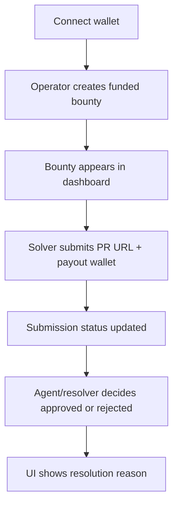
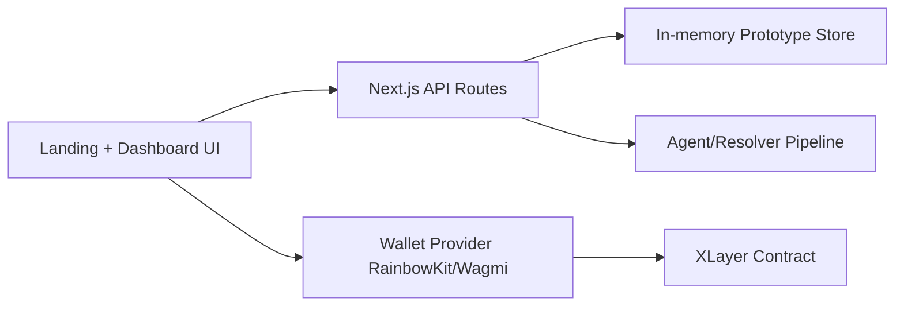

# XLayer-Bounty Frontend

Frontend console for an agent-driven native-OKB bounty workflow on XLayer.


## Problem

Manual bounty operations in open source are slow:
- Maintainers must manually verify each PR.
- Payout decisions take days.
- Contributors get inconsistent feedback loops.

## Solution

This frontend is the operator surface for an agent-first workflow:
- Create bounty with real wallet transaction.
- Submit PR URL plus payout wallet.
- Trigger automated agent checks and track resolution status.

## Market Opportunity

- Open-source teams and dev communities run frequent bounty programs.
- Faster and transparent payout ops can improve contributor retention.
- Agent-assisted verification unlocks scalable bounty programs for small teams.

## Frontend Goals

- **Speed:** bounty creation and submission in a minimal number of clicks.
- **Clarity:** explicit states for open/submitted/resolved items.
- **Trust:** visible PR links, payout wallet, and resolution reason for each bounty.

## Features

- RainbowKit wallet connect in navbar
- Agent-first landing and dashboard UX
- Operator mode: create bounty from GitHub issue URL + OKB amount (wallet transaction)
- Solver mode: submit PR URL + payout wallet against open bounties
- Auto-resolution status and reasoning for agent review loops

## Frontend Flow Diagram



Fallback flow:

```text
Connect wallet -> Create bounty (tx) -> Solver submit (PR + wallet) -> Agent resolves -> UI updates status
```

> This frontend currently uses local API storage for rapid iteration. On-chain contracts live in `../contracts`.

## Agent Use Case

The UI is intended as an operator surface for autonomous workflows:
- Agents monitor bounty state and submission lifecycle.
- Agents evaluate PR progress/status and attach rationale.
- Agents coordinate with contract actions for final resolution.

Local flow details:
- Creating a bounty triggers a real wallet transaction (`createBounty`) on XLayer.
- API layer stores local prototype metadata for rapid UI iteration.
- Solver submissions require both PR URL and payout wallet address.

Reference evaluator logic:
- `../../AutoBounty/contracts/genlayer/BountyJudge.py`

## Component Architecture



## Routes

- `/` — landing page
- `/dashboard` — operator/solver bounty console
- `/api/bounties` — list + create
- `/api/bounties/[id]/submit` — submit PR + resolve prototype flow

## Run

```bash
npm install
npm run dev
```

Open `http://localhost:3000`.

## Environment

Create `.env.local`:

```bash
NEXT_PUBLIC_WALLETCONNECT_PROJECT_ID=your_project_id
```

## Next Integration Step

Replace local API handlers with on-chain calls to `BountyEscrowNative` from `../contracts`:

- `createBounty(issueUrl)` with `msg.value`
- `submitSolution(bountyId, prUrl)`
- `resolveBounty(bountyId, approved)` via relayer/owner

## Demo Script (Quick)

1. Connect wallet in navbar.  
2. In Operator mode, create a bounty with issue URL + amount.  
3. Switch to Solver mode, submit PR URL + payout wallet.  
4. Show status transition and resolution reason on dashboard.

## Deployed Contract

- `BountyEscrowNative` (XLayer testnet): `0xee34aef61c8f20703a89eEcfC1eB5819Fd18FfcC`
- Explorer: [View on OKX XLayer Explorer](https://www.okx.com/web3/explorer/xlayer-test/address/0xee34aef61c8f20703a89eEcfC1eB5819Fd18FfcC)
