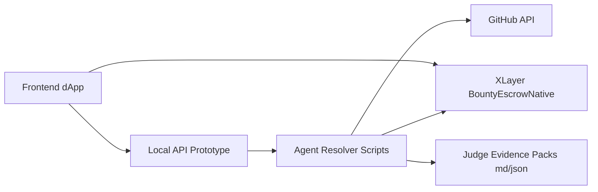
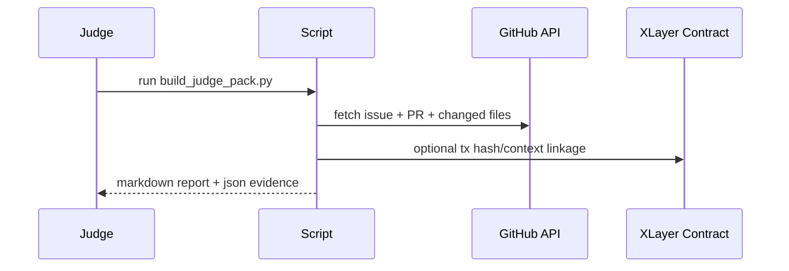

# XLayer-Bounty

XLayer-Bounty is an agent-first bounty automation prototype on XLayer using native OKB escrow.


## Problem

Open-source bounty payouts are slow and inconsistent because PR verification is mostly manual.  
Maintainers become bottlenecks, contributors wait too long, and smaller bounties often get ignored.

## Solution

Use an agent-driven onchain flow:
- Operator creates funded bounty with a wallet transaction.
- Solver submits PR URL plus payout wallet address.
- Agent evaluates GitHub issue + PR signals.
- Contract resolves payout (`approve`) or refund (`reject`) transparently.

## Market Opportunity

- Global open-source contribution and developer incentive programs are large and growing.
- Teams running recurring bounties need faster, auditable reward operations.
- Agent-assisted review + onchain settlement can reduce ops overhead and improve contributor trust.

## Why This Matters

- **For maintainers:** fewer repetitive review-to-payout tasks.
- **For contributors:** faster reward decisions with clearer acceptance signals.
- **For teams:** auditable bounty operations suitable for grants, community programs, and hackathons.


## System Architecture



Fallback architecture:

```text
Frontend -> (wallet tx) -> XLayer contract
Frontend -> local API metadata
Agent scripts -> GitHub API + contract state -> payout decision + judge evidence pack
```

Fallback text flow:

```text
Operator wallet tx -> Solver submission (PR + payout wallet)
-> Agent checks GitHub issue/PR -> Approve?
-> Yes: release to solver
-> No: refund creator
```

## Project Structure

- `frontend/` - Next.js app (operator + solver console)
- `contracts/` - Solidity escrow contracts + agent scripts

## Frontend Overview (`frontend/`)

### Routes
- `/` - landing page
- `/dashboard` - operator/solver bounty console
- `/api/bounties` - list/create bounties (prototype store)
- `/api/bounties/[id]/submit` - submit PR + resolve prototype flow

### User roles
- **Operator:** creates funded bounties and monitors lifecycle.
- **Solver:** submits PR URL and payout wallet.
- **Agent:** evaluates signals, produces recommendation/evidence, and resolves outcomes.

### Run local
```bash
cd frontend
npm install
npm run dev
```

### Wallet env (`frontend/.env.local`)
```bash
NEXT_PUBLIC_WALLETCONNECT_PROJECT_ID=your_project_id
NEXT_PUBLIC_BOUNTY_ESCROW_NATIVE_ADDRESS=0xee34aef61c8f20703a89eEcfC1eB5819Fd18FfcC
```

## Contracts Overview (`contracts/`)

### Deploy native escrow (testnet)
```bash
cd contracts
npm install
cp .env.example .env
npm run deploy:testnet
```

### Deployed contract
- `BountyEscrowNative`: `0xee34aef61c8f20703a89eEcfC1eB5819Fd18FfcC`
- Explorer: [View on OKX XLayer Explorer](https://www.okx.com/web3/explorer/xlayer-test/address/0xee34aef61c8f20703a89eEcfC1eB5819Fd18FfcC)

## Judge-Friendly Verification Flow



## Judge Verification

```bash
cd contracts
pip install -r scripts/requirements-agent.txt
python scripts/build_judge_pack.py --issue-url <issue> --pr-url <pr>
```
