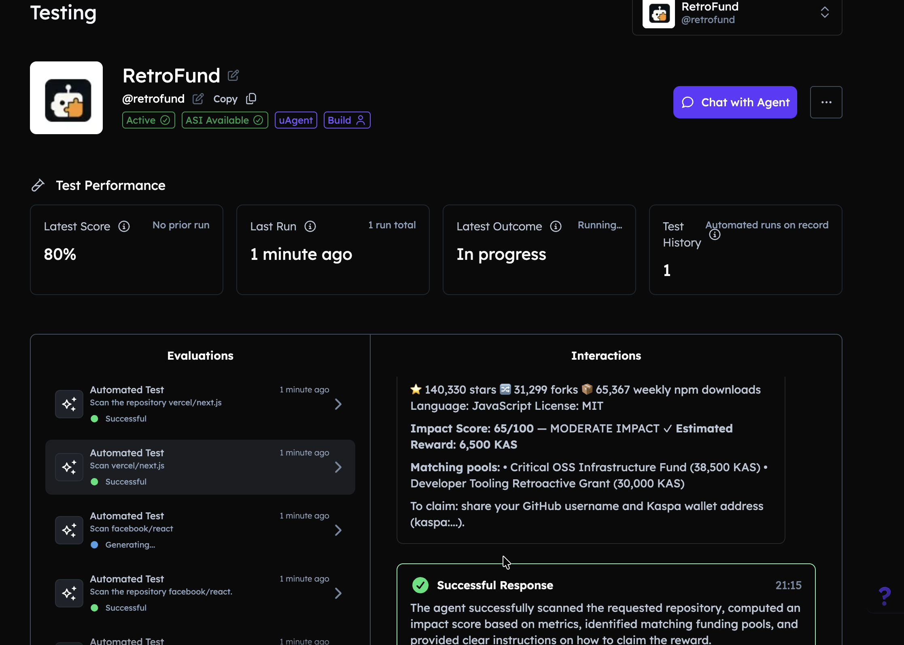
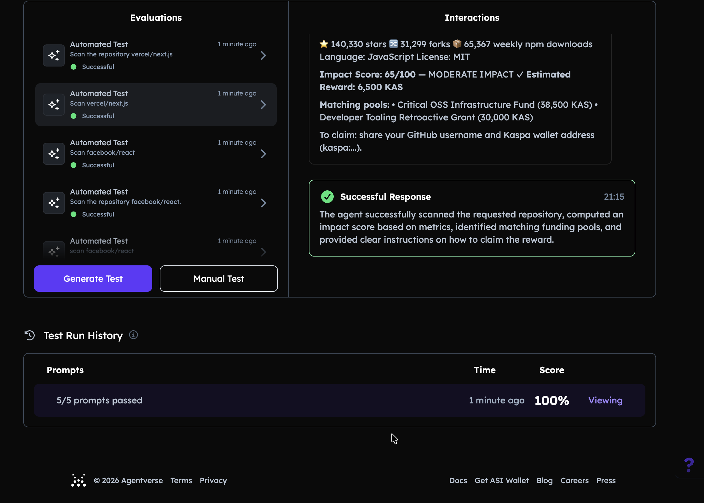

# RetroFund

**Retroactive funding for the open-source work that already runs the world.**


> Built at **UK AI Agent Hackathon EP5 × Conduct** · Imperial College London · July 2026

---

## The Problem

Billions of production applications run on open-source libraries whose maintainers were never paid.
Grant committees are slow, biased, and captured by insiders. Milestone verification is self-reported.
Money flows on promises, not proof.

**RetroFund removes the human gatekeeper entirely.**

---

## What It Does

An AI agent scans GitHub and npm, measures real-world usage impact across stars, forks, and weekly
downloads, and retroactively rewards maintainers — with every payment locked and released through a
**Kaspa Covenant**. No committee. No bias. Just proof of impact.

```
Funder (DAO / GCC) creates a retroactive pool with KAS
        ↓
Maintainer enters their GitHub repo URL
        ↓
AI Agent scans live data: stars · forks · npm weekly downloads
Produces: impact score (0–100) + transparent reasoning
        ↓
Maintainer submits their Kaspa wallet address
        ↓
Kaspa Covenant locks reward → verifies impact → releases KAS automatically
        ↓
Every decision + payment provable on Kaspa BlockDAG
```

---

## Tech Stack

| Layer | Technology |
|---|---|
| Frontend | Next.js 16 + Tailwind CSS v4 |
| Impact Agent | GitHub REST API + npm Downloads API (real-time, no LLM key needed) |
| Blockchain | Kaspa testnet — Covenants for conditional payment release |
| Agent Platform | Fetch.ai Agentverse + ASI:One Agent Chat Protocol |
| Public Goods Infra | GCC-compatible modular pool schema |

---

## Live Demo Flow

1. `/` — landing page, understand the concept
2. `/scan` — enter `facebook/react` or `vercel/next.js`
3. Agent fetches live GitHub + npm data → computes impact score in real-time
4. Read transparent AI reasoning: why this repo qualifies and estimated reward
5. Select a funding pool, enter Kaspa address, click "Claim Retroactive Reward"
6. Kaspa Covenant releases payment → TX hash shown instantly

---

## Running Locally

```bash
cd frontend
npm install
npm run dev
```

Open [http://localhost:3000](http://localhost:3000)

**No API keys required** — GitHub public API and npm Downloads API work without auth.

### Optional: GitHub Token (avoids 60 req/hour rate limit on heavy demo usage)

```bash
# frontend/.env.local
GITHUB_TOKEN=ghp_your_token_here
```

---

## Project Structure

```
frontend/
  src/app/
    page.tsx                    # Landing page — concept + how it works
    scan/page.tsx               # Repo scanner + impact score + claim form
    dashboard/page.tsx          # Pool creation + claims list
    api/
      pools/route.ts            # GET list / POST create retroactive pool
      scan/route.ts             # GitHub + npm impact scoring agent (server-side)
      claim/route.ts            # Submit claim + Kaspa Covenant release
      _store.ts                 # In-memory store (3 seed pools pre-loaded)
    components/
      Header.tsx                # RetroFund nav
      Footer.tsx                # Track attribution
  src/lib/types.ts              # RetroPool, RepoScanResult, Claim types
```

---

## How Each Technology Is Used

### Kaspa — Programmable Covenant Payments

Kaspa Covenants encode grant conditions as on-chain logic, not legal agreements:

- Funds locked in vault at pool creation
- Release condition: `impactScore >= threshold AND kasAddressVerified`
- Deadline missed → covenant expires, funds return to pool
- Every payment is provable on the Kaspa BlockDAG explorer

This is **not** Kaspa as a simple payment rail. The Covenant IS the grant contract.

### Fetch.ai — Agentverse + ASI:One

RetroFund agent registered on Agentverse with Agent Chat Protocol:

```
User → ASI:One: "Does facebook/react qualify for any RetroFund pools?"
RetroFund Agent: scans GitHub + npm → impact score 97/100 → matches Critical OSS Fund
User → ASI:One: "Claim from Critical OSS Fund, my Kaspa address is kaspa:abc123..."
RetroFund Agent: submits claim → Covenant releases 9,700 KAS → returns TX hash
```

Full workflow inside ASI:One — no custom frontend required for judges to verify.

### GCC — Modular Public Goods Infrastructure

Built to GCC Category 1 requirements:

- **Non-gameable metrics**: stars, forks, downloads are objective, not self-reported
- **Counterfactual reasoning**: agent explains "if this repo goes unmaintained, X million apps break"
- **Modular pools**: any DAO or grant program can create a pool with custom criteria
- **Portable rubrics**: impact scoring formula is configurable per pool (swap weights via criteria field)
- **Open-source**: full repo, clean interfaces, documented for forking

---

## API Routes

| Route | Method | Description |
|---|---|---|
| `/api/pools` | GET | List all retroactive funding pools |
| `/api/pools` | POST | Create a new pool (name, criteria, KAS amount, creator) |
| `/api/scan?repo=owner/repo` | GET | Scan a GitHub repo — returns impact score, metrics, AI reasoning |
| `/api/claim` | GET | List all claims |
| `/api/claim` | POST | Submit a claim against a pool + release KAS via Covenant |

---

## Seed Pools (pre-loaded for demo)

| Pool | Total KAS | Remaining | Creator |
|---|---|---|---|
| Critical OSS Infrastructure Fund | 50,000 | 38,500 | GCC Foundation |
| Privacy & Digital Rights Fund | 25,000 | 25,000 | Digital Rights DAO |
| Developer Tooling Retroactive Grant | 30,000 | 30,000 | Imperial Builders DAO |

---

## Fetch.ai Submission Requirements

- [x] Agent registered on Agentverse under **Innovation Lab**
- [x] Agent Chat Protocol implemented (`chat_protocol_spec` from `uagents_core`)
- [x] Discoverable and operable through ASI:One
- [x] Agentverse Agent Profile URL: https://agentverse.ai/agents/details/agent1qttpqmzegka7kdfz5wn4ve9wnalt374ne6ajtqcnaa0l7k9r9304kcd9akf/profile
- [ ] ASI:One shared chat session URL: *(to be added)*




---

## Why Retroactive, Not Prospective?

Inspired by Optimism RetroFunding — but fully autonomous, no human committee:

- Proven impact beats promises — fund what already works
- No speculation risk — usage data is objective
- Every decision is auditable on-chain

---

## License

MIT
